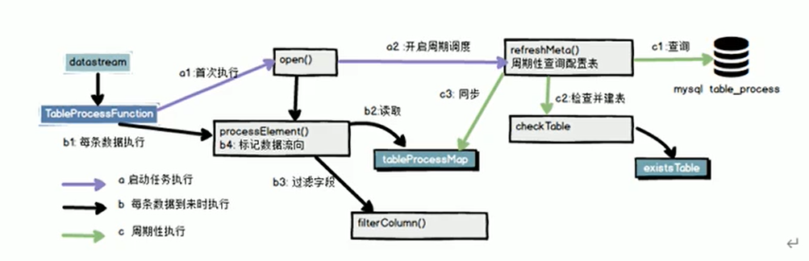
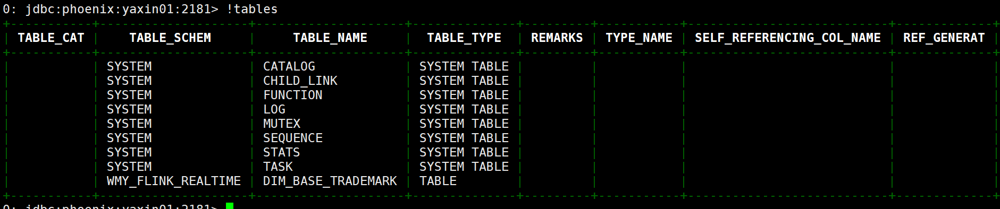

# flink实时数仓

## 实时数仓

### 1、动态分流

### 2、旁路缓存

### 3、异步查询


## HBASE 和 Phoenix结合

- 版本选择：phoenix-5.0.0-HBASE-2.0-bin
- 这个可以去查看hbase高版本的博客，这个是已经部署好了

## DWD层-行为数据

- 识别新老用户 ---> 状态校验、RichProcessFunction富合函数
- 侧输出流做数据拆分
- 将数据输出到Kafka Topic中（页面日志 ---> 主流 | 启动日志、曝光日志 ---> 侧输出流）
- 业务数据：都是状态编程，行为数据要简单得很多

### 1、接收Kafka的数据，并进行转换

#### 1.1 封装操作Kafka的工具类，并提供获取Kafka消费者的方法

~~~java
package com.wmy.flink.warehourse.utils;

import org.apache.flink.api.common.serialization.SimpleStringSchema;
import org.apache.flink.streaming.connectors.kafka.FlinkKafkaConsumer;
import org.apache.kafka.clients.consumer.ConsumerConfig;

import java.util.Properties;

/**
 * ClassName:MyKafkaUtil
 * Package:com.wmy.flink.warehourse.utils
 *
 * @date:2021/7/13 16:46
 * @author:数仓开发工程师
 * @email:2647716549@qq.com
 * @Description: kafka消费者的工具类
 */
public class MyKafkaUtil {

    private static String KAFKA_SERVER = "yaxin01:9092,yaxin02:9092,yaxin03:9092";

    /**
     * 获取Kafka Source的方法
     * FlinkKafkaConsumer ---> FlinkKafkaConsumerBase ---> RichParallelSourceFunction
     * @param topic
     * @param groupID
     * @return
     */
    public static FlinkKafkaConsumer<String> getKafkaSource(String topic,String groupID) {
        // 1、创建Kafka的配置信息
        Properties props = new Properties();

        // 2、配置kafka消费参数
        props.setProperty(ConsumerConfig.BOOTSTRAP_SERVERS_CONFIG, KAFKA_SERVER);
        props.setProperty(ConsumerConfig.GROUP_ID_CONFIG, groupID);

        // 3、获取kafkaSource
        return new FlinkKafkaConsumer<String>(topic, new SimpleStringSchema(), props);
    }

}
~~~

#### 1.2 读取kafka的数据进行新老用户的处理

~~~java
package com.wmy.flink.warehourse.app.dwd;

import com.alibaba.fastjson.JSON;
import com.alibaba.fastjson.JSONObject;
import com.wmy.flink.warehourse.utils.MyKafkaUtil;
import org.apache.flink.api.common.functions.RichMapFunction;
import org.apache.flink.api.common.state.ValueState;
import org.apache.flink.api.common.state.ValueStateDescriptor;
import org.apache.flink.configuration.Configuration;
import org.apache.flink.runtime.state.filesystem.FsStateBackend;
import org.apache.flink.streaming.api.CheckpointingMode;
import org.apache.flink.streaming.api.datastream.DataStreamSource;
import org.apache.flink.streaming.api.datastream.KeyedStream;
import org.apache.flink.streaming.api.datastream.SingleOutputStreamOperator;
import org.apache.flink.streaming.api.environment.StreamExecutionEnvironment;
import org.apache.flink.streaming.connectors.kafka.FlinkKafkaConsumer;

import java.text.SimpleDateFormat;

/**
 * ClassName:LogBaseApp
 * Package:com.wmy.flink.warehourse.app.dwd
 *
 * @date:2021/7/13 16:22
 * @author:数仓开发工程师
 * @email:2647716549@qq.com
 * @Description: 接收Kafka的数据，并进行转换
 * 1) 封装操作Kafka的工具类，并提供获取Kafka消费者的方法
 * 测试Kafka数据读取问题
 *  a）启动集群：Zookeeper\Kafka\HDFS
 *  b）启动Kafka生产者：kafka-console-producer.sh --broker-list yaxin01:9092 --topic ods_base_log
 *  c）测试数据：{"common":{"ar":"110000","uid":"7","os":"Android 11.0","ch":"xiaomi","is_new":"1","md":"Xiaomi 9","mid":"mid_41","vc":"v2.1.132","vc":"v2.1.134","ba":"Xiaomi"},"start":{"entry":"icon","loading_time":7815,"open_ad_id":8,"open_ad_ms":7872,"open_ad_skip_ms":6115},"ts":1592175234000}
 */
public class LogBaseApp {
    public static void main(String[] args) throws Exception {

        // 注意：会出现一个没有权限的错误
        System.setProperty("HADOOP_USER_NAME", "root");

        // 1、获取执行环境，设置并行度，设置状态后端（HDFS）、checkpoint，local模式是不能设置状态恢复的
        StreamExecutionEnvironment env = StreamExecutionEnvironment.getExecutionEnvironment();
        env.setParallelism(1); // kafka topic partitions nums

        // 1.1 设置状态后端
        env.setStateBackend(new FsStateBackend("hdfs://yaxin01:9820/flink-realtime-warehourse/dwd"));

        // 1.2 开启CheckPoint的
        env.enableCheckpointing(10000L, CheckpointingMode.EXACTLY_ONCE); // 每隔多少时间开启checkpoint
        env.getCheckpointConfig().setCheckpointTimeout(60000L); // 超时时间为一分钟

        // 2、读取kafka_ods_base_log 主题数据
        // 2.1 封装一个消费Kafka的工具类
        FlinkKafkaConsumer<String> kafkaSource = MyKafkaUtil.getKafkaSource("ods_base_log", "dwd_log");
        DataStreamSource<String> kafkaDS = env.addSource(kafkaSource);

        // 3、将每行数据转换为JsonObject
        SingleOutputStreamOperator<JSONObject> jsonObjectDS = kafkaDS.map(JSON::parseObject);

        // 4、按照ID分组
        KeyedStream<JSONObject, String> keyedStream = jsonObjectDS.keyBy(data -> data.getJSONObject("common").getString("mid"));

        // 5、使用状态做新老用户校验 ---> 使用复合函数
        SingleOutputStreamOperator<JSONObject> jsonWithNewFlagDS = keyedStream.map(new NewMidRichMapFunc());

        // 打印测试
        jsonWithNewFlagDS.print();

        // 6、分流，使用ProcessFunction将ODS数据拆分成启动、曝光以及页面数据

        // 7、将三个流的数据写入到对应的Kafka主题

        // 8、执行任务
        env.execute("read kafka source write kafka topic ... ");
    }

    /**
     * 做一个字段的校验
     */
    public static class NewMidRichMapFunc extends RichMapFunction<JSONObject,JSONObject> {
        // 声明状态，用于表示当前mid是否以及访问过
        private ValueState<String> firstVisitDateState;
        private SimpleDateFormat simpleDateFormat;

        @Override
        public void open(Configuration parameters) throws Exception {
            firstVisitDateState = getRuntimeContext().getState(new ValueStateDescriptor<String>("new-mid", String.class));
            simpleDateFormat = new SimpleDateFormat("yyyy-MM-dd");
        }

        @Override
        public JSONObject map(JSONObject value) throws Exception {
            // 取出新用户标记
            String isNew = value.getJSONObject("common").getString("is_new");

            // 如果当前前端传输数据表示为新用户，则进行校验
            if ("1".equals(isNew)) {
                // 取出状态数据，并取出当前访问时间
                String firstDate = firstVisitDateState.value();
                Long ts = value.getLong("ts");

                // 判断状态数据是否为null
                if (firstDate != null) {
                    // 修复
                    value.getJSONObject("common").put("is_new", 0);
                } else {
                    // 更新数据
                    firstVisitDateState.update(simpleDateFormat.format(ts));
                }
            }
            return value;
        }
    }
}
~~~

#### 1.3 测试数据

~~~json
{"common":{"ar":"110000","uid":"7","os":"Android 11.0","ch":"xiaomi","is_new":"1","md":"Xiaomi 9","mid":"mid_41","vc":"v2.1.132","vc":"v2.1.134","ba":"Xiaomi"},"start":{"entry":"icon","loading_time":7815,"open_ad_id":8,"open_ad_ms":7872,"open_ad_skip_ms":6115},"ts":1592175234000}
~~~


#### 1.4 读取Kafka数据经过新老用户处理之后进行分流操作

~~~java
package com.wmy.flink.warehourse.app.dwd;

import com.alibaba.fastjson.JSON;
import com.alibaba.fastjson.JSONArray;
import com.alibaba.fastjson.JSONObject;
import com.wmy.flink.warehourse.utils.MyKafkaUtil;
import org.apache.flink.api.common.functions.RichMapFunction;
import org.apache.flink.api.common.state.ValueState;
import org.apache.flink.api.common.state.ValueStateDescriptor;
import org.apache.flink.configuration.Configuration;
import org.apache.flink.runtime.state.filesystem.FsStateBackend;
import org.apache.flink.streaming.api.CheckpointingMode;
import org.apache.flink.streaming.api.datastream.DataStream;
import org.apache.flink.streaming.api.datastream.DataStreamSource;
import org.apache.flink.streaming.api.datastream.KeyedStream;
import org.apache.flink.streaming.api.datastream.SingleOutputStreamOperator;
import org.apache.flink.streaming.api.environment.StreamExecutionEnvironment;
import org.apache.flink.streaming.api.functions.ProcessFunction;
import org.apache.flink.streaming.connectors.kafka.FlinkKafkaConsumer;
import org.apache.flink.util.Collector;
import org.apache.flink.util.OutputTag;

import java.text.SimpleDateFormat;

/**
 * ClassName:LogBaseApp
 * Package:com.wmy.flink.warehourse.app.dwd
 *
 * @date:2021/7/13 16:22
 * @author:数仓开发工程师
 * @email:2647716549@qq.com
 * @Description: 接收Kafka的数据，并进行转换
 * 1) 封装操作Kafka的工具类，并提供获取Kafka消费者的方法
 * 测试Kafka数据读取问题
 *  a）启动集群：Zookeeper\Kafka\HDFS
 *  b）启动Kafka生产者：kafka-console-producer.sh --broker-list yaxin01:9092 --topic ods_base_log
 *  c）测试数据：{"common":{"ar":"110000","uid":"7","os":"Android 11.0","ch":"xiaomi","is_new":"1","md":"Xiaomi 9","mid":"mid_41","vc":"v2.1.132","vc":"v2.1.134","ba":"Xiaomi"},"start":{"entry":"icon","loading_time":7815,"open_ad_id":8,"open_ad_ms":7872,"open_ad_skip_ms":6115},"ts":1592175234000}
 */
public class LogBaseApp {
    public static void main(String[] args) throws Exception {

        // 注意：会出现一个没有权限的错误
        System.setProperty("HADOOP_USER_NAME", "root");

        // 1、获取执行环境，设置并行度，设置状态后端（HDFS）、checkpoint，local模式是不能设置状态恢复的
        StreamExecutionEnvironment env = StreamExecutionEnvironment.getExecutionEnvironment();
        env.setParallelism(1); // kafka topic partitions nums

        // 1.1 设置状态后端
        //env.setStateBackend(new FsStateBackend("hdfs://yaxin01:9820/flink-realtime-warehourse/dwd"));

        // 1.2 开启CheckPoint的
        //env.enableCheckpointing(10000L, CheckpointingMode.EXACTLY_ONCE); // 每隔多少时间开启checkpoint
        //env.getCheckpointConfig().setCheckpointTimeout(60000L); // 超时时间为一分钟

        // 2、读取kafka_ods_base_log 主题数据
        // 2.1 封装一个消费Kafka的工具类
        FlinkKafkaConsumer<String> kafkaSource = MyKafkaUtil.getKafkaSource("ods_base_log", "dwd_log");
        DataStreamSource<String> kafkaDS = env.addSource(kafkaSource);

        // 3、将每行数据转换为JsonObject
        SingleOutputStreamOperator<JSONObject> jsonObjectDS = kafkaDS.map(JSON::parseObject);

        // 4、按照ID分组
        KeyedStream<JSONObject, String> keyedStream = jsonObjectDS.keyBy(data -> data.getJSONObject("common").getString("mid"));

        // 5、使用状态做新老用户校验 ---> 使用复合函数
        SingleOutputStreamOperator<JSONObject> jsonWithNewFlagDS = keyedStream.map(new NewMidRichMapFunc());

        // 打印测试
        //jsonWithNewFlagDS.print();

        // 6、分流，使用ProcessFunction将ODS数据拆分成启动、曝光以及页面数据
        SingleOutputStreamOperator<String> pageDS = jsonWithNewFlagDS.process(new SpiltProcessFunc());

        // 7、将三个流的数据写入到对应的Kafka主题
        DataStream<String> startDS = pageDS.getSideOutput(new OutputTag<String>("start") {
        });
        DataStream<String> displayDS = pageDS.getSideOutput(new OutputTag<String>("display") {
        });

        // 打印测试
        pageDS.print("page >>>>>>> ");
        startDS.print("start >>>>>>> ");
        displayDS.print("display >>>>>>> ");

        // 8、执行任务
        env.execute("read kafka source write kafka topic ... ");
    }

    /**
     * 做一个字段的校验
     */
    public static class NewMidRichMapFunc extends RichMapFunction<JSONObject,JSONObject> {
        // 声明状态，用于表示当前mid是否以及访问过
        private ValueState<String> firstVisitDateState;
        private SimpleDateFormat simpleDateFormat;
        @Override
        public void open(Configuration parameters) throws Exception {
            firstVisitDateState = getRuntimeContext().getState(new ValueStateDescriptor<String>("new-mid", String.class));
            simpleDateFormat = new SimpleDateFormat("yyyy-MM-dd");
        }
        @Override
        public JSONObject map(JSONObject value) throws Exception {
            // 取出新用户标记
            String isNew = value.getJSONObject("common").getString("is_new");
            // 如果当前前端传输数据表示为新用户，则进行校验
            if ("1".equals(isNew)) {
                // 取出状态数据，并取出当前访问时间
                String firstDate = firstVisitDateState.value();
                Long ts = value.getLong("ts");

                // 判断状态数据是否为null
                if (firstDate != null) {
                    // 修复
                    value.getJSONObject("common").put("is_new", 0);
                } else {
                    // 更新数据
                    firstVisitDateState.update(simpleDateFormat.format(ts));
                }
            }
            return value;
        }
    }

    // 将数据分流到kafka中
    public static class SpiltProcessFunc extends ProcessFunction<JSONObject,String>{
        @Override
        public void processElement(JSONObject value, Context ctx, Collector<String> out) throws Exception {
            // 提前"start字段"
            String startStr = value.getString("start");
            // 判断是否为启动数据
            if (startStr != null && startStr.length() > 0) {
                // 将启动日志输出到侧输出流
                ctx.output(new OutputTag<String>("start"){}, value.toString());
            } else {
                // 不是启动日志，继续判断是否是曝光数据
                JSONArray displays = value.getJSONArray("displays");
                if (displays != null && displays.size() > 0) {
                    // 曝光数据，是一个数组类型的，遍历写入侧输出流
                    for (int i = 0; i < displays.size(); i++) {
                        // 取出单条曝光数据
                        JSONObject displayJson = displays.getJSONObject(i);
                        // 添加页面ID
                        displayJson.put("page_id", value.getJSONObject("page").getString("page_id"));
                        // 输出到侧输出流中
                        ctx.output(new OutputTag<String>("display"){}, displayJson.toString());
                    }
                } else {
                    // 页面数据，将数据输出到主流，主流使用collect
                    out.collect(value.toString());
                }
            }
        }
    }
}
~~~

#### 1.5 测试数据

~~~json
-- 启动日志
{"common":{"ar":"310000","ba":"Xiaomi","ch":"xiaomi","md":"Xiaomi 10 Pro ","mid":"mid_7","os":"Android 10.0","uid":"177","vc":"v2.1.134"},"start":{"entry":"icon","loading_time":15351,"open_ad_id":19,"open_ad_ms":8660,"open_ad_skip_ms":0},"ts":1592179997000}

-- 曝光数据
{"common":{"ar":"310000","ba":"Xiaomi","ch":"xiaomi","md":"Xiaomi 10 Pro ","mid":"mid_7","os":"Android 10.0","uid":"177","vc":"v2.1.134"},"displays":[{"display_type":"activity","item":"2","item_type":"activity_id","order":1},{"display_type":"promotion","item":"9","item_type":"sku_id","order":2},{"display_type":"promotion","item":"7","item_type":"sku_id","order":3},{"display_type":"promotion","item":"9","item_type":"sku_id","order":4},{"display_type":"recommend","item":"1","item_type":"sku_id","order":5},{"display_type":"query","item":"8","item_type":"sku_id","order":6}],"page":{"during_time":18532,"page_id":"home"},"ts":1592180012351}

-- 页面数据
{"common":{"ar":"310000","ba":"Xiaomi","ch":"xiaomi","md":"Xiaomi 10 Pro ","mid":"mid_7","os":"Android 10.0","uid":"177","vc":"v2.1.134"},"page":{"during_time":19041,"item":"联想","item_type":"keyword","last_page_id":"home","page_id":"good_list"},"ts":1592180030883}
~~~

#### 1.6 运行程序


#### 1.7 将行为数据分流写入kafka

##### 1.7.1 LogBaseApp

~~~java
package com.wmy.flink.warehourse.app.dwd;

import com.alibaba.fastjson.JSON;
import com.alibaba.fastjson.JSONArray;
import com.alibaba.fastjson.JSONObject;
import com.wmy.flink.warehourse.utils.MyKafkaUtil;
import org.apache.flink.api.common.functions.RichMapFunction;
import org.apache.flink.api.common.state.ValueState;
import org.apache.flink.api.common.state.ValueStateDescriptor;
import org.apache.flink.configuration.Configuration;
import org.apache.flink.runtime.state.filesystem.FsStateBackend;
import org.apache.flink.streaming.api.CheckpointingMode;
import org.apache.flink.streaming.api.datastream.DataStream;
import org.apache.flink.streaming.api.datastream.DataStreamSource;
import org.apache.flink.streaming.api.datastream.KeyedStream;
import org.apache.flink.streaming.api.datastream.SingleOutputStreamOperator;
import org.apache.flink.streaming.api.environment.StreamExecutionEnvironment;
import org.apache.flink.streaming.api.functions.ProcessFunction;
import org.apache.flink.streaming.connectors.kafka.FlinkKafkaConsumer;
import org.apache.flink.util.Collector;
import org.apache.flink.util.OutputTag;

import java.text.SimpleDateFormat;

/**
 * ClassName:LogBaseApp
 * Package:com.wmy.flink.warehourse.app.dwd
 *
 * @date:2021/7/13 16:22
 * @author:数仓开发工程师
 * @email:2647716549@qq.com
 * @Description: 接收Kafka的数据，并进行转换
 * 1) 封装操作Kafka的工具类，并提供获取Kafka消费者的方法
 * 测试Kafka数据读取问题
 *  a）启动集群：Zookeeper\Kafka\HDFS
 *  b）启动Kafka生产者：kafka-console-producer.sh --broker-list yaxin01:9092 --topic ods_base_log
 *  c）测试数据：{"common":{"ar":"110000","uid":"7","os":"Android 11.0","ch":"xiaomi","is_new":"1","md":"Xiaomi 9","mid":"mid_41","vc":"v2.1.132","vc":"v2.1.134","ba":"Xiaomi"},"start":{"entry":"icon","loading_time":7815,"open_ad_id":8,"open_ad_ms":7872,"open_ad_skip_ms":6115},"ts":1592175234000}
 */
public class LogBaseApp {
    public static void main(String[] args) throws Exception {

        // 注意：会出现一个没有权限的错误
        System.setProperty("HADOOP_USER_NAME", "root");

        // 1、获取执行环境，设置并行度，设置状态后端（HDFS）、checkpoint，local模式是不能设置状态恢复的
        StreamExecutionEnvironment env = StreamExecutionEnvironment.getExecutionEnvironment();
        env.setParallelism(1); // kafka topic partitions nums

        // 1.1 设置状态后端
        //env.setStateBackend(new FsStateBackend("hdfs://yaxin01:9820/flink-realtime-warehourse/dwd"));

        // 1.2 开启CheckPoint的
        //env.enableCheckpointing(10000L, CheckpointingMode.EXACTLY_ONCE); // 每隔多少时间开启checkpoint
        //env.getCheckpointConfig().setCheckpointTimeout(60000L); // 超时时间为一分钟

        // 2、读取kafka_ods_base_log 主题数据
        // 2.1 封装一个消费Kafka的工具类
        FlinkKafkaConsumer<String> kafkaSource = MyKafkaUtil.getKafkaSource("ods_base_log", "dwd_log");
        DataStreamSource<String> kafkaDS = env.addSource(kafkaSource);

        // 3、将每行数据转换为JsonObject
        SingleOutputStreamOperator<JSONObject> jsonObjectDS = kafkaDS.map(JSON::parseObject);

        // 4、按照ID分组
        KeyedStream<JSONObject, String> keyedStream = jsonObjectDS.keyBy(data -> data.getJSONObject("common").getString("mid"));

        // 5、使用状态做新老用户校验 ---> 使用复合函数
        SingleOutputStreamOperator<JSONObject> jsonWithNewFlagDS = keyedStream.map(new NewMidRichMapFunc());

        // 打印测试
        //jsonWithNewFlagDS.print();

        // 6、分流，使用ProcessFunction将ODS数据拆分成启动、曝光以及页面数据
        SingleOutputStreamOperator<String> pageDS = jsonWithNewFlagDS.process(new SpiltProcessFunc());

        // 7、将三个流的数据写入到对应的Kafka主题
        DataStream<String> startDS = pageDS.getSideOutput(new OutputTag<String>("start") {
        });
        DataStream<String> displayDS = pageDS.getSideOutput(new OutputTag<String>("display") {
        });

        // 打印测试
        //pageDS.print("page >>>>>>> ");
        //startDS.print("start >>>>>>> ");
        //displayDS.print("display >>>>>>> ");

        pageDS.addSink(MyKafkaUtil.getKafkaSink("dwd_page_log"));
        startDS.addSink(MyKafkaUtil.getKafkaSink("dwd_start_log"));
        displayDS.addSink(MyKafkaUtil.getKafkaSink("dwd_display_log"));

        // 8、执行任务
        env.execute("read kafka source write kafka topic ... ");
    }

    /**
     * 做一个字段的校验
     */
    public static class NewMidRichMapFunc extends RichMapFunction<JSONObject,JSONObject> {
        // 声明状态，用于表示当前mid是否以及访问过
        private ValueState<String> firstVisitDateState;
        private SimpleDateFormat simpleDateFormat;
        @Override
        public void open(Configuration parameters) throws Exception {
            firstVisitDateState = getRuntimeContext().getState(new ValueStateDescriptor<String>("new-mid", String.class));
            simpleDateFormat = new SimpleDateFormat("yyyy-MM-dd");
        }
        @Override
        public JSONObject map(JSONObject value) throws Exception {
            // 取出新用户标记
            String isNew = value.getJSONObject("common").getString("is_new");
            // 如果当前前端传输数据表示为新用户，则进行校验
            if ("1".equals(isNew)) {
                // 取出状态数据，并取出当前访问时间
                String firstDate = firstVisitDateState.value();
                Long ts = value.getLong("ts");

                // 判断状态数据是否为null
                if (firstDate != null) {
                    // 修复
                    value.getJSONObject("common").put("is_new", 0);
                } else {
                    // 更新数据
                    firstVisitDateState.update(simpleDateFormat.format(ts));
                }
            }
            return value;
        }
    }

    // 将数据分流到kafka中
    public static class SpiltProcessFunc extends ProcessFunction<JSONObject,String>{
        @Override
        public void processElement(JSONObject value, Context ctx, Collector<String> out) throws Exception {
            // 提前"start字段"
            String startStr = value.getString("start");
            // 判断是否为启动数据
            if (startStr != null && startStr.length() > 0) {
                // 将启动日志输出到侧输出流
                ctx.output(new OutputTag<String>("start"){}, value.toString());
            } else {
                // 不是启动日志，继续判断是否是曝光数据
                JSONArray displays = value.getJSONArray("displays");
                if (displays != null && displays.size() > 0) {
                    // 曝光数据，是一个数组类型的，遍历写入侧输出流
                    for (int i = 0; i < displays.size(); i++) {
                        // 取出单条曝光数据
                        JSONObject displayJson = displays.getJSONObject(i);
                        // 添加页面ID
                        displayJson.put("page_id", value.getJSONObject("page").getString("page_id"));
                        // 输出到侧输出流中
                        ctx.output(new OutputTag<String>("display"){}, displayJson.toString());
                    }
                } else {
                    // 页面数据，将数据输出到主流，主流使用collect
                    out.collect(value.toString());
                }
            }
        }
    }
}

~~~

##### 1.7.2 MyKafkaUtil

~~~java
package com.wmy.flink.warehourse.utils;

import org.apache.flink.api.common.serialization.SimpleStringSchema;
import org.apache.flink.streaming.connectors.kafka.FlinkKafkaConsumer;
import org.apache.flink.streaming.connectors.kafka.FlinkKafkaProducer;
import org.apache.kafka.clients.consumer.ConsumerConfig;

import java.util.Properties;

/**
 * ClassName:MyKafkaUtil
 * Package:com.wmy.flink.warehourse.utils
 *
 * @date:2021/7/13 16:46
 * @author:数仓开发工程师
 * @email:2647716549@qq.com
 * @Description: kafka消费者的工具类
 */
public class MyKafkaUtil {

    private static String KAFKA_SERVER = "yaxin01:9092,yaxin02:9092,yaxin03:9092";
    private static Properties props = new Properties();

    static {
        props.setProperty(ConsumerConfig.BOOTSTRAP_SERVERS_CONFIG, KAFKA_SERVER);
    }

    /**
     * 获取Kafka Source的方法
     * FlinkKafkaConsumer ---> FlinkKafkaConsumerBase ---> RichParallelSourceFunction
     * @param topic
     * @param groupID
     * @return
     */
    public static FlinkKafkaConsumer<String> getKafkaSource(String topic,String groupID) {


        // 1、配置kafka消费参数
        props.setProperty(ConsumerConfig.GROUP_ID_CONFIG, groupID);

        // 2、获取kafkaSource
        return new FlinkKafkaConsumer<String>(topic, new SimpleStringSchema(), props);
    }

    public static FlinkKafkaProducer<String> getKafkaSink(String topic) {
        return new FlinkKafkaProducer<String>(topic, new SimpleStringSchema(), props);
    }

}

~~~

##### 1.7.3 测试数据

~~~json
-- 启动日志
{"common":{"ar":"310000","ba":"Xiaomi","ch":"xiaomi","md":"Xiaomi 10 Pro ","mid":"mid_7","os":"Android 10.0","uid":"177","vc":"v2.1.134"},"start":{"entry":"icon","loading_time":15351,"open_ad_id":19,"open_ad_ms":8660,"open_ad_skip_ms":0},"ts":1592179997000}

-- 曝光数据
{"common":{"ar":"310000","ba":"Xiaomi","ch":"xiaomi","md":"Xiaomi 10 Pro ","mid":"mid_7","os":"Android 10.0","uid":"177","vc":"v2.1.134"},"displays":[{"display_type":"activity","item":"2","item_type":"activity_id","order":1},{"display_type":"promotion","item":"9","item_type":"sku_id","order":2},{"display_type":"promotion","item":"7","item_type":"sku_id","order":3},{"display_type":"promotion","item":"9","item_type":"sku_id","order":4},{"display_type":"recommend","item":"1","item_type":"sku_id","order":5},{"display_type":"query","item":"8","item_type":"sku_id","order":6}],"page":{"during_time":18532,"page_id":"home"},"ts":1592180012351}

-- 页面数据
{"common":{"ar":"310000","ba":"Xiaomi","ch":"xiaomi","md":"Xiaomi 10 Pro ","mid":"mid_7","os":"Android 10.0","uid":"177","vc":"v2.1.134"},"page":{"during_time":19041,"item":"联想","item_type":"keyword","last_page_id":"home","page_id":"good_list"},"ts":1592180030883}
~~~

##### 1.7.4 展示结果


#### 1.8 测试问题说明

~~~properties
checkpoint：出现异常就会自动重启

就是如果出现了脏数据的情况下或者解析数据失败，并不会立即的退出程序，而是处于无限的循环的状态
所以我们为了要保证集群的稳定性，最好是要设置重启失败的策略

官网地址：https://ci.apache.org/projects/flink/flink-docs-release-1.13/docs/deployment/config/

和重启策略有关系
env.setRestartStrategy(RestartStrategies.fixedDelayRestart(3, Time.seconds(1)));

在实际生成中最好都是要开启状态后端，checkpoint和重启策略的
env.setRestartStrategy(RestartStrategies.noRestart());

我们可以捕获异常，这样把脏数据给过滤掉

也可以看一个脏数据的比例和分析脏数据的缘由来提升程序的健壮性
~~~


### 2、DWD层（行为数据 整体测试）

~~~properties
日志数据DWD层测试所需进程

Mock、Nginx、Logger、Kafka(ZK)、Flink_APP(HDFS\kafka)、三台消费者

dwd_page_log
dwd_start_log
dwd_display_log

主要是读取kafka数据进行，然后在进行分流
~~~

## DWD层-业务数据

### 需求说明

#### 1、业务说明

~~~properties
 业务数据得变化，我们可以通过MaxWell采集到，但是MaxWell是把全部数据统一写入一个topic中，这些数据包括业务数据，也包括维度数据，这样显然不利于日后得数据处理，所以这个功能是从kafka得业务数据ODS层读取数据，经过处理后，将维度数据保存到HBASE，将事实数据写回kafka作为业务数据得DWD层
~~~

#### 2、接收kafka数据，过滤空值数据

~~~properties
 对maxwell抓取数据进行ETL，有用得部分保留，没有用得部分过滤掉
~~~

#### 3、实现动态分流

~~~properties
 由于MaxWell是把全部数据统一写入一个topic中，这样显然不利于日后的数据处理，所以需要把各个表拆开处理，但是由于每个表有不同的特点，有些表是维度表，有些表是事实表，有些表既是事实表在某种情况下又是维度表。
 在实时计算中一般把维度数据写入一个存储容器中，一般是方便通过主键查询的数据库比如HBASE\REDIS\MYSQL等，一般把事实表写入流中，进行进一步处理，最终形成宽表，但是作为Flink事实计算任务，如何得知那些表是维度表，那些是事实表，而这些表又应该采集那些字段勒？
 这样的配置不是和写在配置文件中，因为这样的花，业务端随着雪球变化每增加一张表
 
 使用配置表的方式是可以不用停机操作的，配置文件中必须是一个外部的配置文件，而且还需要每隔一段时间就必须要去访问一次，否则万一出现数据的变更，我们使用的是MySQL来进行存储配置数据表，用来加载配置信息，配置信息还不能写死，代码中还必须使用一个定时任务，Spark源码中，master以一个固定的时间来进行校验worker是否超时
~~~


#### 4、把分好的流保存到对应表、主题中

~~~properties
1、业务数据保存到Kafka主题中
2、维度数据保存到HBASE的表中
~~~

### 代码实现

#### 1、接收kafka数据，过滤空值数据

~~~java
package com.wmy.flink.warehourse.app.dwd;

import com.alibaba.fastjson.JSON;
import com.alibaba.fastjson.JSONObject;
import com.wmy.flink.warehourse.utils.MyKafkaUtil;
import org.apache.flink.api.common.functions.FilterFunction;
import org.apache.flink.api.common.restartstrategy.RestartStrategies;
import org.apache.flink.api.common.time.Time;
import org.apache.flink.runtime.executiongraph.restart.RestartStrategy;
import org.apache.flink.runtime.state.filesystem.FsStateBackend;
import org.apache.flink.streaming.api.CheckpointingMode;
import org.apache.flink.streaming.api.datastream.DataStreamSource;
import org.apache.flink.streaming.api.datastream.SingleOutputStreamOperator;
import org.apache.flink.streaming.api.environment.StreamExecutionEnvironment;
import org.apache.flink.streaming.connectors.kafka.FlinkKafkaConsumer;

/**
 * ClassName:DbBaseApp
 * Package:com.wmy.flink.warehourse.app.dwd
 *
 * @date:2021/7/14 10:07
 * @author:数仓开发工程师
 * @email:2647716549@qq.com
 * @Description: 分析业务数据
 */
public class DbBaseApp {
    public static void main(String[] args) throws Exception {

        // 1、获取执行环境
        StreamExecutionEnvironment env = StreamExecutionEnvironment.getExecutionEnvironment();
        env.setParallelism(1);

        // 1.1 checkpointn
        //env.setStateBackend(new FsStateBackend("hdfs://yaxin01:9820/flink-realtime-warehourse/dwd"));
        //env.enableCheckpointing(1000L, CheckpointingMode.EXACTLY_ONCE);
        //env.getCheckpointConfig().setCheckpointTimeout(60000L);
        //env.setRestartStrategy(RestartStrategies.fixedDelayRestart(3, Time.seconds(3)));
        //env.setRestartStrategy(RestartStrategies.noRestart());

        // 2、读取Kafka数据
        FlinkKafkaConsumer<String> kafkaSource = MyKafkaUtil.getKafkaSource("ods_base_db_m", "ods_db_group");
        DataStreamSource<String> kafkaDS = env.addSource(kafkaSource);

        // 3、将每行数据转换为JSON对象
        SingleOutputStreamOperator<JSONObject> jsonObjDS = kafkaDS.map(JSON::parseObject);

        // 4、过滤
        SingleOutputStreamOperator<JSONObject> filterDS = jsonObjDS.filter(new FilterFunction<JSONObject>() {
            @Override
            public boolean filter(JSONObject value) throws Exception {
                // 获取一个data字段{"data":{"id":30,"user_name":"zhangsan","tel":"19845368388"}}
                String data = value.getString("data");
                return data != null && data.length() > 0;
            }
        });

        // 打印测试
        /**
         * 测试说明，由于我没有采集那些的数据，没有实时采集MySQL中的数据到kafka中，所以我是直接生产到kafka中
         *
         * 数据：
         * {"database":"gmall","xid":111,"data":{"id":30,"user_name":"zhangsan","tel":"19845368388"}}
         */
        filterDS.print();

        // 5、分流，ProcessFunction，如果使用状态的可以使用复合函数


        // 6、取出分流输出将数据写入kafka或者phonix


        // 7、执行任务
        env.execute("DbBaseApp >>>>>>> ");
    }
}
~~~


#### 2、根据MySQL的配置，实现动态分流

##### 2.1 MySQL配置表的创建

~~~sql
create table `table_process`(
`source_table` varchar(200) not null comment '来源表',
`operate_type` varchar(200) not null comment '操作类型 insert,update,delete',
`sink_type` varchar(200) default null comment '输出类型 hbase kafka',
`sink_table` varchar(200) default null comment '输出表（主题）',
`sink_columns` varchar(200) default null comment '输出字段',
`sink_pk` varchar(200) default null comment '主键字段',
`sink_extend` varchar(200) default null comment '建表扩展',
primary key (`source_table`,`operate_type`)
)engine=InnoDB default charset=utf8;
~~~


##### 2.2 程序流程分析



~~~properties
open:
	获取数据，如果只是调用一次的，这样的话动态分流就完成不了，停机重启，需要开启一个周期调度任务，这个需要放到open方法里面，open生命周期方法，查询一个配置表（MySQL）
	
hbase/kafka：
	这个主要是看MySQL中的配置信息，如果单条数据
	
checkTable：	
	不需要自己去phoenix，去创建表，是让系统给我们自己去创建表，这样我就不需要一个扩展字段，不存在就创建，存在的话就不创建，跟配置信息MySQL的表相关
	
filterColumn：
	删除一些不需要的字段，到底是要往哪里去写
	
应该是先读取一次性配置信息，然后才开始周期性的去读取这个配置信息

需要检查并建表

同步然后在封装在map中，如果这是一个新增的维度信息，感觉把这个表给建立一下
processelement读取配置信息过滤字段，将我们的信息给分流
~~~

##### 2.3 程序的测试

~~~properties
动态获取配置信息以及创建Phoenix测试流程
因为目前我是确实业务数据到kafka这个流程，我直接就是生产到kafka中
进程：zk,kafka,hadoop,hbase,phoenix,

如果有的同步机制的话，我们是直接在MySQL当中采用binlog日志来进行

现在我是直接模拟生成最后采集的那个json数据，这些都是手动写的

需要开启Kafka生成者
~~~

###### 2.3.1 模拟同步的日志

~~~json
{"database":"gmall","xid":305,"data":{"tm_name":"vivo","log_url":"https://item.jd.com/100009989503.html","id":"13"},"commit":true,"type":"delete","table":"base_trademark","ts":1626346291}
~~~





~~~properties
注意：这个是我们在更新数据库中得东西得时候，主键必须是一致得，否则会报错得，要不然就不会出现结果了
~~~

#### 3、分流维度数据到HBASE中

~~~json
{"database":"gmall","xid":5520,"data":{"id":"28","tm_name":"vivo","log_url":"https://item.jd.com/100009989503.html"},"commit":true,"type":"insert","table":"aa","ts":1626346292}
~~~


#### 4、分流事实数据到Kafka中

~~~json
hbase:

{"database":"gmall","xid":5520,"data":{"id":"28","tm_name":"vivo","log_url":"https://item.jd.com/100009989503.html"},"commit":true,"type":"insert","table":"aa","ts":1626346292}

{"database":"gmall","xid":5520,"data":{"id":"30","tm_name":"vivo","log_url":"https://item.jd.com/100009989503.html"},"commit":true,"type":"insert","table":"bb","ts":1626346292}


kafka:

{"database":"gmall","xid":305,"data":{"tm_name":"vivo","log_url":"https://item.jd.com/100009989503.html","id":"31"},"commit":true,"type":"insert","table":"cc","ts":1626346291}
~~~


### 总结


#### 1、完整代码可以去看博客

#### 2、查看结果


## DWM 

### 1、Kafka精准一次性语义 注意事项

DbBaseApp.java

~~~properties
这个如果打开这个状态后端和checkpoint测试的话

env.setStateBackend(new FsStateBackend("hdfs://yaxin01:9820/flink-realtime-warehourse/dwd"));
env.enableCheckpointing(1000L, CheckpointingMode.EXACTLY_ONCE);
env.getCheckpointConfig().setCheckpointTimeout(60000L);
env.setRestartStrategy(RestartStrategies.fixedDelayRestart(3, Time.seconds(3)));
env.setRestartStrategy(RestartStrategies.noRestart());

缺少一个包，会报一个错，hdfs-schema找不到
<!--如果保存检查点到hdfs上，需要引入此依赖-->
<dependency>
    <groupId>org.apache.hadoop</groupId>
    <artifactId>hadoop-client</artifactId>
    <version>${hadoop.version}</version>
</dependency>

但是还是会报kafka的事务的超时时间太短了
数据源kafka，sink也是kafka，可以实现一个端到端的精准一次性，实现两阶段提交
到checkpoint真正完成提交去执行，然后才能真正的去执行，
在kafka中开启事务，这个事务也有自己的超时时间，这两个超时时间应该谁大一些
开启事务，预提交，来一条写一条
什么时候关闭，checkpoint完成,jobmanager通知才真正完成
checkpint > kafka 事务
如果checkpoint的时间大于kafka的事务的时间，kafka挂掉了，但是checkpoint成功了，事务失败了，回滚了，消费数据是从checkpoint之后开始消费，但是会数据丢失

checkpoint < kafka事务使劲啊
如果checkpoint失败了，事务回滚，没有问题，如果开启checkpoint，kafka exactly once
这个时候要加一个参数
env.getCheckpointConfig().setCheckpointTimeout(60000L);

所以我们还得在flinkKafkaProducer中设置事务的时间
public static <T> FlinkKafkaProducer<T> 							getKafkaSinkBySchema(KafkaSerializationSchema<T> kafkaSerializationSchema) {
	props.setProperty(ProducerConfig.TRANSACTION_TIMEOUT_CONFIG, 5 * 60 * 1000L + "");
	return new FlinkKafkaProducer<T>(DEFAULT_TOPIC, kafkaSerializationSchema, props, FlinkKafkaProducer.Semantic.EXACTLY_ONCE);
}

事务是根据checkpoint的结果来进行提交的,kafka 的事务时间要比kafka的 checkpoint的时间要大
~~~

### 2、分层思路

~~~properties
ODS ---> DWD ---> DWM ---> DWS ---> ADS
越靠近ADS，越是要看需求，去拆分表的时候，没有太多的去考虑需求

业务数据，我们在配置信息的时候是需要考虑业务逻辑的
ODS DWD 如何考虑维度建模，不是考虑最后做什么需求去建立的
MySQL在做维度退化的时候，表会少一点，星型模型

商品信息sku，spu，trademark合并
维度退化，表少了
维度建模，确定维度，根据维度选择度量值，度量是最后的需求，DWD按照维度来进行建立的
字段，还是有关系的，关系性不是那么强的

DWM做一个预处理，减少业务的复杂性，DWS可能会复用DWM层的表

实现方式不一样，分层思路是一样的

需求：
	访客　　　－－－＞　可视化大屏
	商品　　　－－－＞　可视化大屏 ---> 多维分析 | 可视化大屏 
	地区　　　－－－＞　可视化大屏
	关键词　　－－－＞　可视化大屏

ADS 需求：
	有一些需求不一定是来自DWS，也有可能来自DWD层

访客：
	PV：page_log ---> dwd
	UV：page_log过滤去重 ---> dwm
	跳出率：page_log判定（离开平台） ---> dwm
	进入页面数：识别开始访问 ---> dwd
	连续访问时长：page_log直接可求 ---> dwd
	
商品：
	点赞、收藏、加购物车
	下单 ---> 可视化大屏 ---> 订单宽表 ---> dwm
	
地区：
	下单 ---> 订单宽表  ---> dwm
	订单宽表比支付宽表的话跟复杂
	
关键词：
	搜索关键词  ---> 页面访问日志、直接可求 ---> dwd
	点击商品关键词 ---> 商品主题下单再次聚合 ---> dws
	下单商品关键词 ---> 商品主题下单再次聚合 ---> dws
	
广告投放，手机APP付款的页面比较小
订单的跳出页面比较高，这个页面可能有问题，分析用户的付款率比较低，没有下单，支付，购物车
从那个页面跳出比较多，整个网页做的不好，用户详情页比较高，多多少少都有问题

营业额比较低
但是不知道细节，从销售渠道来进行分析，不同的定义，跳出率，引流和推广的跳出率
方式的不同，导致实现的方式不同，跳出数/总数
过滤的方式来求跳出数

中间层，并不是为了能够出指标，而是提供复用性

大屏看的都是地区名称，需要进行关联，订单宽表
DWM结合DWD在一次聚合得到一个聚合操作，Clickhouse可以按照SQL分析

业务计算：
	访问UV计算
	跳出明细计算
	订单宽表
	支付宽表
~~~

### 3、访客UV计算

#### 3.1 业务说明

~~~properties
UV，独立访客数，对于实时计算中，即每日活跃用户，因为实时计算中的UV是指当日的访客数
那么如何从用户行为日志中识别当日的访客数
1、识别访客打开第一个页面就进入我们的应用
2、访客一天中多次进入应用，我们要在一天范围内进行去重
~~~

#### 3.2 从kafka的dwd_page_log主题接收数据

#### 3.3 核心代码过滤

#### 3.4 过滤后的UV写到Kafka的DWM层中

#### 3.5 测试

~~~json
{"common":{"ar":"310000","uid":"177","os":"Android 10.0","ch":"xiaomi","md":"Xiaomi 10 Pro ","mid":"mid_8","vc":"v2.1.134","ba":"Xiaomi"},"page":{"page_id":"good_list","item":"联想","during_time":19041,"item_type":"keyword","last_page_id":""},"ts":1592180030885}

{"common":{"ar":"310000","uid":"177","os":"Android 10.0","ch":"xiaomi","md":"Xiaomi 10 Pro ","mid":"mid_9","vc":"v2.1.134","ba":"Xiaomi"},"page":{"page_id":"good_list","item":"联想","during_time":19041,"item_type":"keyword","last_page_id":""},"ts":1592183630}
~~~


### ４、跳出明细计算

Flink使用CEP来进行复杂事件的处理

### ５、订单宽表

#### 5.1 双流Join Interval

~~~java
package com.wmy.flink.warehourse.app.dwm;

import com.alibaba.fastjson.JSON;
import com.alibaba.fastjson.JSONObject;
import com.wmy.flink.warehourse.bean.OrderDetail;
import com.wmy.flink.warehourse.bean.OrderInfo;
import com.wmy.flink.warehourse.bean.OrderWide;
import com.wmy.flink.warehourse.utils.MyKafkaUtil;
import org.apache.avro.Schema;
import org.apache.flink.api.common.eventtime.SerializableTimestampAssigner;
import org.apache.flink.api.common.eventtime.WatermarkStrategy;
import org.apache.flink.runtime.state.filesystem.FsStateBackend;
import org.apache.flink.streaming.api.CheckpointingMode;
import org.apache.flink.streaming.api.datastream.DataStreamSource;
import org.apache.flink.streaming.api.datastream.KeyedStream;
import org.apache.flink.streaming.api.datastream.SingleOutputStreamOperator;
import org.apache.flink.streaming.api.environment.StreamExecutionEnvironment;
import org.apache.flink.streaming.api.functions.co.ProcessJoinFunction;
import org.apache.flink.streaming.api.windowing.time.Time;
import org.apache.flink.streaming.connectors.kafka.FlinkKafkaConsumer;
import org.apache.flink.util.Collector;

import java.text.SimpleDateFormat;

/**
 * ClassName:OrderWideApp
 * Package:com.wmy.flink.warehourse.app.dwm
 *
 * @date:2021/7/20 9:15
 * @author:数仓开发工程师
 * @email:wmy_2000@163.com
 * @Description:
 */
public class OrderWideApp {
    public static void main(String[] args) throws Exception {
        // 1、获取执行环境
        StreamExecutionEnvironment env = StreamExecutionEnvironment.getExecutionEnvironment();
        env.setParallelism(1);

        // 1.1 设置状态后端
        env.getCheckpointConfig().setCheckpointStorage("hdfs://yaxin01:9820/flink-realtime-warehourse/dwd_log/ck");
        env.enableCheckpointing(10000L, CheckpointingMode.EXACTLY_ONCE);
        env.getCheckpointConfig().setCheckpointTimeout(60000L);

        // 2、读取kafka订单和订单明细主题数据 dwd_order_info dwd_order_detail
        String orderInfoSourceTopic = "dwd_order_info";
        String orderDetailSourceTopic = "dwd_order_detail";
        String orderWideSinkTopic = "dwm_order_wide";
        String groupId = "order_wide_group";

        FlinkKafkaConsumer<String> orderInfoKafkaSource = MyKafkaUtil.getKafkaSource(orderInfoSourceTopic, groupId);
        FlinkKafkaConsumer<String> orderDetailKafkaSource = MyKafkaUtil.getKafkaSource(orderDetailSourceTopic, groupId);
        DataStreamSource<String> orderInfoKafkaDS = env.addSource(orderInfoKafkaSource);
        DataStreamSource<String> orderDetailKafkaDS = env.addSource(orderDetailKafkaSource);

        // 3、将每行数据转换为JavaBean，提取时间戳生成WaterMark
        WatermarkStrategy<OrderInfo> orderInfoWatermarkStrategy = WatermarkStrategy.<OrderInfo>forMonotonousTimestamps()
                .withTimestampAssigner(new SerializableTimestampAssigner<OrderInfo>() {
                    @Override
                    public long extractTimestamp(OrderInfo element, long recordTimestamp) {
                        return element.getCreate_ts();
                    }
                });

        WatermarkStrategy<OrderDetail> orderDetailWatermarkStrategy = WatermarkStrategy.<OrderDetail>forMonotonousTimestamps()
                .withTimestampAssigner(new SerializableTimestampAssigner<OrderDetail>() {
                    @Override
                    public long extractTimestamp(OrderDetail element, long recordTimestamp) {
                        return element.getCreate_ts();
                    }
                });

        KeyedStream<OrderInfo, Long> orderInfoWithIdKeyedStream = orderInfoKafkaDS.map(jsonStr -> {
            // 时间格式化
            SimpleDateFormat simpleDateFormat = new SimpleDateFormat("yyyy-MM-dd HH:mm:ss");

            // 将JSON字符串转换为JavaBean
            OrderInfo orderInfo = JSON.parseObject(jsonStr, OrderInfo.class);

            // 取出创建时间字段
            String create_time = orderInfo.getCreate_time();

            // 按照空格分隔
            String[] createTimeArr = create_time.split(" ");

            orderInfo.setCreate_date(createTimeArr[0]);
            orderInfo.setCreate_hour(createTimeArr[1]);
            orderInfo.setCreate_ts(simpleDateFormat.parse(create_time).getTime());
            return orderInfo;
        }).assignTimestampsAndWatermarks(orderInfoWatermarkStrategy)
                .keyBy(OrderInfo::getId);

        KeyedStream<OrderDetail, Long> orderDetailWithOrderIdKeyedStream = orderDetailKafkaDS.map(jsonStr -> {
            SimpleDateFormat simpleDateFormat = new SimpleDateFormat("yyyy-MM-dd HH:mm:ss");
            OrderDetail orderDetail = JSON.parseObject(jsonStr, OrderDetail.class);
            orderDetail.setCreate_ts(simpleDateFormat.parse(orderDetail.getCreate_time()).getTime());
            return orderDetail;
        }).assignTimestampsAndWatermarks(orderDetailWatermarkStrategy)
                .keyBy(OrderDetail::getOrder_id);

        // 4、双流JOIN
        SingleOutputStreamOperator<OrderWide> orderWideDs = orderInfoWithIdKeyedStream.intervalJoin(orderDetailWithOrderIdKeyedStream)
                .between(Time.seconds(-5), Time.seconds(5)) // 生产环境，为了不丢失数据，设置时间为最大的延迟时间
                .process(new ProcessJoinFunction<OrderInfo, OrderDetail, OrderWide>() {

                    @Override
                    public void processElement(OrderInfo left, OrderDetail right, Context ctx, Collector<OrderWide> out) throws Exception {
                        out.collect(new OrderWide(left, right));
                    }
                });

        // 测试打印
        orderWideDs.print();


        // 执行任务
        env.execute("OrderWideApp >>> ");

    }
}
~~~

***学习链接***

https://blog.csdn.net/u013516966/article/details/102952239

整个处理逻辑都是基于数据时间的，也就是intervaljoin 必须基于EventTime语义，在between 中有做TimeCharacteristic是否为EventTime校验, 如果不是则抛出异常。

#### 5.2 维度关联

这个就是维度得封装

#### 5.3 优化1：加入旁路缓存模式

~~~properties
直接查询，出现流式计算得性能瓶颈，cache aside pattern
中间加了一个缓存层
hbase关闭得时候要执行一次刷写操作

维度数据
订单宽表 ---> 缓存（Redis）---> 维度数据
未命中，在查Phoenix，查到了要同步Redis，查到得数据同步到Redis

1、缓存要设置过期时间，不然数据常驻内存浪费资源，要考虑维度数据是否发生变化，如果发生变化要主动清除缓存
	如何清除缓存，维度数据可能发生变化，
2、使用Redis来缓存
	公司当中采用二级缓存，堆内存，查询数据，在hashMap钟，以后查询数据都在Map中查找一下，
二级缓存，Phoenix Redis MemCache 堆内存当前程序得内存
	堆内存采用得是HashMap，Phoenix ---> Redis ---> 堆内存
	代码DBbaseLog，进程得堆内存
	Redis是一个独立得服务，公用得资源，HashMap是一个linkedHashMap
	加入了一个LRU CAche
	jdbc 也有，最近最少使用得算法
~~~

```java
package com.mysql.cj.util;

import java.util.LinkedHashMap;
import java.util.Map.Entry;

public class LRUCache<K, V> extends LinkedHashMap<K, V> {
    private static final long serialVersionUID = 1L;
    protected int maxElements;

    public LRUCache(int maxSize) {
        super(maxSize, 0.75F, true);
        this.maxElements = maxSize;
    }

    protected boolean removeEldestEntry(Entry<K, V> eldest) {
        return this.size() > this.maxElements;
    }
}
```

~~~properties
查询前 ---> Redis ---> 查询之后同步到Redis中
测试数据；
Redis重要的一点就是布隆过滤器 flushall ---> 这个是测试
加速测试，查询添加删除，这种过程的话增加我们的性能

创建连接慢，并不是访问慢，加一个缓存就是为了减少和phoenix之间的交互

问题：
如果数据更新了，在DimUtil增加失效缓存的方法，维度数据变化时要失效的缓存
Redis中删除一个内容的时候，是不需要取判断它是否存在的，不会报错，只会返回0或者1

在DWD入库的时候，我们增加了缓存的操作，这样的话，可以增加性能，所以我们需要测试各种情况说明

内存数据库，毕竟是一个外部系统，所以尽量的要去避免q
~~~

#### 5.4 优化2：异步查询

~~~properties
在Flink流处理中，经常需要和外部系统来进行交互，用维度表不全事实表中的字段，例如：在电商场景中，需要一个商品的skuid去关联商品的一些属性，例如商品所属行业商品的生产厂家，生产厂家的一些情况，在物流场景中，知道包裹ID，需要去关联包裹行业属性，发货信息，收货信息等

默认情况下，在Flink的MapFunction中，单个并行度只能用同步的方式去交互，将请求发送到外部系统中，IO阻塞，等待请求返回，然后继续发送下一个请求，这种同步交互的方式往往在网络等待上就耗费了大量时间，为了提高处理效率，可以增加MapFunction的并行度，当增加并行度就意味着更多的资源，并不是一种非常好的解决方式

Async I/O 是阿里巴巴贡献给社区的一个呼声非常高的一个特性，解决与外部系统交互时网络延迟成为了系统瓶颈的问题

异步查询实际上是把维表的查询操作托管给单独的线程池完成，这样不会以为某一个查询造成阻塞，单个并行可以连续发送给多个请求，提供并发效率

排序或者不排序的，对这个数据的顺序是没有什么影响的，所以我们没有排序
~~~


[Flink I/O 异步](https://ci.apache.org/projects/flink/flink-docs-release-1.13/zh/docs/dev/datastream/operators/asyncio/)

~~~properties
MapFunction是一个同步的请求，MapFunction，知道回应被收到之后在进行处理，这个是同步的，等待请求的方式不好，并行的话，去消耗资源，线程连接，数据库的连接，缓冲和内存也增加了，资源的占用也就更高了 
异步IO和提高并行度是优化的两种方式
增加机器也是一种优化方案，最有效的方案

条件：
１、数据库需要支持异步交互操作客户端
２、如果没有这种客户端，可以创建多个客户端，使用多线程的方式来调用这种方案，比正规的异步方案要低很多　－－－＞　多线池和多线程

启动一个线程所需要的方式
Runnable,new Thread ---> 都不建议去使用
去创建一个线程池来进行使用

实现分发请求的 AsyncFunction  ---> 自定义的
获取数据库交互的结果并发送给 ResultFuture 的 回调 函数，继续返回到流中，维度信息关联之后才能往下游去传递，结果响应好了之后然后才回调
将异步 I/O 操作应用于 DataStream 作为 DataStream 的一次转换操作。

是否进行排序的操作，unOrder效率更高，不用 管进来的顺序，如果数据又顺序要求还是使用order

TimeOut，超时时间，只有拿到响应才能把数据往下传递，交给超时的数据去传送就好了
Capacity： 容量参数定义了可以同时进行的异步请求数。 即使异步 I/O 通常带来更高的吞吐量，执行异步 I/O 操作的算子仍然可能成为流处理的瓶颈。 限制并发请求的数量可以确保算子不会持续累积待处理的请求进而造成积压，而是在容量耗尽时触发反压

超时的话可以去选择性的去重写它

DimAsyncFunction

关联之后也还是都一样的，如果把类型写死了，这样不太好，我们可以使用泛型来进行限制

open asyncInvoke timeout
1、初始化线程池 ---> 线程池的工具类 JUC中，提供了ThreadPoolExecutor pool
使用懒汉式和饿汉式

LinkedBlockingQueue  ---> 有界
ArrayBlockingQueue   ---> 无界

TheadPoolUtil ---> 连接池
不能确保一个并行度一个连接池
单例模式 ---> 饿汉式，加锁机制，双重判断模式，锁的是new 操作
两个人同时判断，此时都是null，A先拿到，B在外面，如果加了锁之后，A创建之后就不创建了

编写代码的技巧：
    1、如果有些方法我们是不确定的，我们可以使用抽象类加抽象方法的思路来进行维度的关联，既然确定不了，那么就提取到外部进行编写代码
    2、刚开始编写代码的时候，我们是采用在DimAsyncFunction中定义一个抽象，最后我们是把规范接口给设置下来了
    3、方法模板，很多封装的方法，我们可以封装成一个模板，这样在封装的时候就不会报错了，如果在封装当中是实现不了的，使用的时候在进行一个重写的操作
~~~

***测试***

~~~properties
测试异步查询的操作
测试用户维度关联
	1、将table_process表中的数据删除掉，需要往这个表中添加维度和事实的一些基本的配置信息
	2、启动程序：
		CDC（mysql ---> kafka）
		zk
		kafka
		hdfs
		hbase
		redis
	3、运行APP
		DbBaseApp ---> 这个分析的是一个业务数据
	4、初始化用户维度数据到hbase中（可以使用FLink CDC的方式）
	5、运行OrderWideApp ---> 订单信息和订单明细来join成的一个订单宽表
	6、打包测试
	7、查看kafka中是否又年龄和性别这个两个数据的信息
~~~

***测试心得***

~~~properties
DbBaseApp ---> 用户的维度信息已经到Phoenix中的
OrderWideApp ---> 关联维度 (Redis)

重点：
    1、从MySQL中存储的是一个业务数据，所以我们需要把这些维度数据存储在hbase中，所以我们加入了Redis的旁路缓存的方式来进行优化hbaseJsonDS.addSink(new DimSink()) 查询到的数据就写到redis中，如果是update操作的化就直接删除，还要设置一些过期的时间操作

从hbase中读取维度和kafka中的数据进行关联

这些都关联好了之后，然后进行一个最后的一个测试

只不过重要的一点就是如何同步MySQL中的业务数据到kafka中，可以通过CDC 来进行一个完成操作

后续的都基本上都是一致的

是整个项目的难度和重点
动态分流 ---> 日志数据
业务数据 ---> Redis旁路缓存、异步查询、线程池

~~~

### ６、支付宽表

#### 6.1 需求分析与思路

~~~properties
支付宽表的目的，最主要的原因时支付表没有到订单明细，支付金额没有细分到商品上，没有办法统计商品级的支付状况。
所以本次宽表的核心就是要把支付表的信息与订单明细关联上

解决方案有两个
1、一个是把订单明细（宽表）输出到hbase上，在支付宽表计算查询hbase，这相当于把订单明细作为一种维度进行管理
2、一个是把用流的方式接受订单明细，然后用双流join方式进行合并，因为订单与支付产生有一定时差，所以必须使用Interval join来管理流的状态时间

BeanUtils.copyProperties

~~~

***测试数据***

```properties
kafka、zk、hbase、hdfs、phoenix、redis

---> 业务数据
ods_base_db_m

---> 动态分流
 ---> Redis 旁路缓存
 ---> 线程池、Flink异步查询
dwd_order_info
dwd_order_detail
dwd_payment_info

---> 双流join
dwm_order_wide
dwm_payment_wide

生成数据 --->  DWM
```

#### 6.2 支付宽表和时间工具类

~~~properties
SimpleDateFormat：线程安全问题
来一条创建一条，多线程操作过程中同时操作一个对象，如果只是读没有影响
sdf ---> calendar ---> setTime

StringBuffer

DateTimeUtil ---> 编写一个时间工具类

map和提取时间戳，都是单线程的，多个并行度也不会有同一个，如果提出去，也是没有问题，都是单线程在执行，submit都是单线程在进行执行的
~~~

## DWM 回顾

### 0、实时数仓架构

~~~properties
Springboot用来写数据接口层的，所以有时间我还是要学习一下
维度表和事实表
DWS
~~~

### 1、行为数据 数据流

~~~properties
动态分流
旁路缓存
异步查询
~~~

### 2、业务数据、动态分流

~~~properties
Canal/MaxWell
Flink CDC

读取数据，分流split
使用侧输出流，processFunction的方式

先读取一次配置信息，然后周期性的读取配置信息，Phoenix配置
先加载一次配置信息，因为周期性的任务开始，读取数据，开启另外一个线程，一直在调度，一旦我们开启任务调度open方法已经完成，周期性的任务市没有办法完成的

mysql map 建表
processFunction

记住，我们在同步数据的时候一定要注意，变更数据的那个字段是否和我们配置表中的字段是否是一样的
自己说的多就犯错越少
使用maxwell 的 operator_insert 和我们的insert做了一个处理，注意是要了解JSON的格式
我们加了字段Sink_table，主题都是在配置信息中，配置信息把sink_table，接下来我们才真正做了过滤字段，可以不用过滤，生产环境当中建议都是要保留的，因为多了比少了好

如果少了的话，业务线都得改，早期设计的话，前面的话都要，业务线很清洗之后然后才能对字段有一个明确的认识

驼峰命名，泛型，这个面试的话，就不需要去聊了
~~~

### 3、业务数据 异步IO

~~~properties
动态分流这个图的话，可以去好好的整理一下
记住在建表的时候，一定要注意单引号的一个问题，要不然的话就会报错
id,t_name
id:varchar,t_name:varchar
这个往哪里放数据勒，这个就是太麻烦了，一个字段的字段的判断，upsert 的SQL复杂程度写出去没有关系，用得时候在转一下就好了，正常的往里面写就行

封装一个工具类，写到Kafka，主题的数据，都是在一个流中，没有办法写死这个主题，我们选择了自定义Shema，把主题信息给携带者，ProducerRecord

订单宽表
两张事实表  ---> order_info order_detail 双流join
六张维度表  ---> 用户、省份、sku、spu、品牌、品类
需要考虑先关联那个维度
注意顺序：
sku ---> spu、品牌、品类
只有是在后面就行

默认是保存的是几天，他是没有办法去考量的
AsyncFunction
getKey()
join()封装的是也给泛型的方法

支付事实表
和订单宽表的宽连都是类似的
~~~

## DWS 与 DWM 层的设计

### 1、设计思路

~~~properties
我们在之前通过分流等手段，把数据分拆成了独立的kafka topic，那么接下来如何处理数据，就要思考一下我们到底要通过实时计算出那些指标项
因为实时计算和离线不同，实时计算的开发和运维成本都是非常高的，要结合实际情况考虑是否有必要像离线数仓一样，建一个大而全的中间层
如果没有必要大而全，这个时候就需要大体规划一下要实时计算出的指标的需求，把这些指标以宽表的形式输出就是我们的DWS层

beeline -u jdbc:hive2://hadoop102:10000 -n wmy
hive --service hiveserver2 ----> hiveserver.sh

================== 访客主题宽表的计算
统计主题	需求指标		输出方式		计算来源				来源层级
访客		  PV	    	可视化大屏		page_log直接求			 dwd
访客		  UV			可视化大屏		page_log过滤去重		dwm
访客		  跳出率     	  可视化大屏	 	  page_log行为判断		  dwm
访客		  进入页面数		 可视化大屏	 	 需要访问开始标记		  dwd
访客		  连续访问时长    可视化大屏		 page_log直接求		 dwd

设计一张表DWS层的表其实就是两件事，维度和度量（事实数据）
	1、度量包括PV、UV、跳出次数、进入页面数（session_count）、连续访问时长
	2、维度包括在分析中的比较重要的几个字段，渠道、地区、版本、新老用户进行聚合

coaleasce 三张表join的时候，dwm，dws
flink,union ,connect,我们在聚合的时候采用的是union的操作，不用考虑是否存在的情况

select * from tableA full join tableB on tableA.id = tableB.id full join tableC on coaleasce(tableA.id,tableB.id)=tableC.id;
~~~

### 2、实现过程

~~~properties
三个主题，四个流，五个指标
String pageViewSourceTopic = "dwd_page_log"; // LogBaseApp
String uniqueVisitSourceTopic = "dwm_unique_visit"; //DayAcitilyUserCountApp
String userJumpDetailSourceTopic = "dwm_user_jum_detail";//UserJumpDetailApp

3.1 将页面流格式化为VisitorStats ---> PV和访问时长
3.2 将页面数据流像过滤格式化为VisitorStats ---> sv_ct（进入次数）
3.3 将uvDS格式化为VisitorStats ---> UV
3.4 将userJumpDS格式化为VisitorStats ---> uj_ct(跳出次数)

//度量：独立访客数 uv_ct
//度量：页面访问数 pv_ct
//度量： 进入次数 sv_ct
//度量： 跳出次数 uj_ct
//度量： 持续访问时间 dur_sum
~~~

***union***

~~~properties
union 类型必须是一样的
使用flink sql 也能做，flink sql 也有full join
~~~

## DWS 访客主题

 开窗处理 思路分析

~~~properties
重点：将时间格式化转换为最新版本的，要不然会出现线程等安全的问题

测试：resultDS.print("resultDS >>>> ");
最后的指标就是从Clickhouse 写SQL出来

kafka中有多少个主题   --- > 事实表
dwd_cart_info
dwd_category1
dwd_comment_info
dwd_display_log
dwd_order_detail
dwd_order_info
dwd_order_refund_info
dwd_page_log
dwd_payment_info
dwd_refund_payment
dwd_start_log
dwm_order_wide
dwm_payment_wide
dwm_unique_visit
dwm_user_jump_detail
ods_base_db
ods_base_log

生产日志数据流
每隔十秒钟会出一次key

如果不是10秒钟的，会出现很多次，如果没有汇总的情况的话，性能会很低调的，所以最好是做一个开窗的处理

也可以使用测试一下不开窗的统计，reduce，这个打印的数据的话，一直在打印这个流一直在刷，如果是真的这样的话,clickhouse的性能不好，还得要求clickhouse那边有去重的功能
~~~

### 4、DWS层回顾

~~~properties
数据流的回复
画图，每天画一次
DWS层，根据需求来，维度指标都合并在大宽表中，由公司定，自己知道从那些维度表中出来
学会归类，除了现在的需求，能不能多考虑一下扩展，以后能不能用，对于商品来说，点击、曝光、收藏、那些商品就可以放到一个大宽表
商品、地区、关键词都是一些重点
来源去哪里取数据，需求DWS一定是根据需求有关的，聊数仓的维度建模，说离线和实时，都一定要分清，ods,dwd，跟业务比较低
dwm,dws ---> dws是每天，lambda，不是分开的，实时去拿结果，如果过了今天，这个时候可以去走离线的数仓，走的是离线的结果
dws,dwt ---> 每天的聚合，dwt是一个累积的结果

实时的数据流侧重于一个时效性，牺牲准确性保证时效性，水位线和延迟，侧输出流，以最快的时间看近似的结果，然后在慢慢的走，两个数仓不是分开的，本质的性能都是一样，分析指标都是类似的
离线和实时的指标都是一样的

离线 flume
实时Spring boot 直接将数据写到kafka
这些都是可以做离线和实时，实时是用spring boot，两套不可能同时去跑，主题的数据是否重复，如果不用的话，不就是一个浪费的，这个是不合理的

聊架构，只有一套架构，先开始离线部分，flume采集的这种，但是一般来说，公司很少有做架构，太复杂的，实在不行了才更新，越大的更新，公司用得都比较低公司不会轻易的去换的

公司运行了很多项目，过期的代码和实例都是白写了，架构也是一样，统一说一套就好了，实时性的要求比较高，两套架构的优缺点都有优点和缺点，更看重的是缺点

面试的时候，不能是完美无缺的，存在即合理的情况

主题：dws：访客主题宽表的计算
pv
uv
跳出率 ---> 行为判断，先求出跳出数
进入页面数 ---> 开始访问表示，last_page_id为null
连续访问时长 ---> 这个做一个累加的就好了，三个主题四个流五个指标
可以来自于同一个流一次性算出来的，最早是来自同一个主题，直接可以page_log来进行求出

CEP提取的是一个超时的数据，要的是后面不存在的数据，定一个10秒的匹配时间，如果匹配不上，超时那么就认为是没有吓一跳数据，这个是有相似点的，有包含关系的，前一跳和后一跳

数据的加工方式不同而已，直接从dwm ---> UV、跳出率

除了算指标以外，还要加入各种维度信息，如果不加入维度的话，对于后期的分析很难
渠道、地区、版本、新老用户
对总的进行sum，分组求和的操作，最细粒度的指标进行更高维的指标是没有问题的
有维度的基础上去掉维度是很简单的

来自于四个流的数据，合并join或者是union，join，包含了connect，可以作为join,比join更加的另外，除了常用的（左右全外）join之后还有

connect算子，首先和join,connect除了那些，之前写代码做过全外
实时对账可以做全外连接
两条流保存状态，没有数据保存在状态中，如果只是写左边的数据，两边都写的
dataStream一定要想到connect
window join在窗口的内部，不能跨窗口进行join
只有connect

如果是flink sql，full join，inner join left join ,right join
connect 在API中比join还强大的，保存状态之外，还强大了,inner join必须是keyedStream
connect是不要求keyedStream，更加的灵活
包含关系keyedStream表示的范围更加的小
inner jion要求更多一些,on

connect只是简单的将两个流合并成一个流，想到join或者是Union，不能保证这些都有这些的维度的组合，怎么可能那些维度和key相同
会想到用full join,如果想到用connect的话，这样真的好麻烦，hive sql中使用coalsce这样的话要好一些，转换为javabean

可以转换一个表对象来进行full join，关联的字段使用coalsce防止出现一个膨胀的情况，如果真的注意一下这个全外连接的一个坑，union的方法，既有flink sql和flink datastream
在公司当中使用一个就好了，公司当中很少有两套的，其它人接你的项目也会很通过，中间还调了一下python脚本，尽量的话统一，学东西，都尽量的去学一些

用的话随便拿来用一下就好了，随便用一下就好了
在数仓中的用法都是一样的，可视化数据，都必须是一样的额，在代码中传的类型必须是完全一样的

union，补零的操作，如果不写的这样 可以吗，第一张表，补的字段都是必须给写上的，构造方法就会报错了

开窗和水位线是否能去重，或者clickhouse是否能够接受这个性能的访问，这个数据的访问，一组数据，四个维度组合的组合数据，在这个10秒钟，本来是有很多条的话，正常往里面写

在跳出的APP，过10秒才能进行跳出，等待当前数据是否超时，很有可能这个窗口已经关闭了
把所有的数据都给收集进来

窗口不是为了准确，而是为了数据量，各个窗口中的数据进行累加，类似于滚动的一个效果，可以使用处理时间来进行

和以前做的开窗是不一样，计算开窗的类的数据结果，如果是放错的话，都是没有关系的
~~~

## Flink & Clickhouse 

database rank：https://db-engines.com/en/ranking

flink jdbc example: [JDBC | Apache Flink](https://ci.apache.org/projects/flink/flink-docs-release-1.13/docs/connectors/datastream/jdbc/)

### 1、Clickhouse 封装工具类

~~~properties
<dependency>
    <groupId>org.apache.flink</groupId>
    <artifactId>flink-connector-jdbc_2.11</artifactId>
    <version>1.13.0</version>
</dependency>

<dependency>
    <groupId>ru.yandex.clickhouse</groupId>
    <artifactId>clickhouse-jdbc</artifactId>
    <version>0.3.1</version>
    <exclusions>
        <exclusion>
            <groupId>com.fasterxml.jackson.core</groupId>
            <artifactId>jackson-databind</artifactId>
        </exclusion>
        <exclusion>
            <groupId>com.fasterxml.jackson.core</groupId>
            <artifactId>jackson-core</artifactId>
        </exclusion>
    </exclusions>
</dependency>
~~~

2、创建clickhouse表

~~~sql
create table vistor_stats(
	stt DateTime,
    edt DateTime,
    vc String,
    ch String,
    ar String,
    is_new String,
    uv_ct Uint64,
    pv_ct Uint64,
    sv_ct Uint64,
    uj_ct Uint64,
    dur_sum Uint64,
    ts Uint64
) engine = ReplacingMergeTree(ts)
partition by toYYYYMMDD(stt)
order by (stt,edt,is_new,vc,ch,ar);
~~~

一定要加一个创建时间做一个分区操作

~~~properties
如何控制对象的属性是否写出去和表的列名做对比
如何去操作勒？
我们可以使用注解的标记来进行开发
@Transient // 短暂的,这个不做序列化操作
~~~

```java
package com.wmy.flink.warehourse.utils;

import com.wmy.flink.warehourse.bean.TransientSink;
import com.wmy.flink.warehourse.common.WmyConfig;
import org.apache.flink.connector.jdbc.JdbcConnectionOptions;
import org.apache.flink.connector.jdbc.JdbcExecutionOptions;
import org.apache.flink.connector.jdbc.JdbcSink;
import org.apache.flink.connector.jdbc.JdbcStatementBuilder;
import org.apache.flink.streaming.api.functions.sink.SinkFunction;

import java.lang.reflect.Field;
import java.sql.PreparedStatement;
import java.sql.SQLException;

/**
 * ClassName:ClickHouseUtil
 * Package:com.wmy.flink.warehourse.utils
 *
 * @date:2021/7/25 8:00
 * @author:数仓开发工程师
 * @email:wmy_2000@163.com
 * @Description: clickhouse 工具类
 */
public class ClickHouseUtil {
    // 流中的数据类型是：visitorStats
    public static <T> SinkFunction getSink(String sql) {
        return JdbcSink.sink(
                sql,
                new JdbcStatementBuilder<T>() {
                    @Override
                    public void accept(PreparedStatement preparedStatement, T t) throws SQLException {
                        // 封装的泛型也不知道是什么类型的
                        // 反射的方式来获取属性名
                        // javaBean，未来也想调用这个，有些javaBean的属性是不想调出去，在表里面没有，工具类中有，占位符不要
                        // 属性和表的列不对等，属性>=表的列
                        // 有的属性是不想写道clickhouse中
                        // 如何使用注解
                        // 定义一个计数，跳过的属性
                        int offset = 0;
                        Field[] fields = t.getClass().getDeclaredFields();// 权限问题，拿到所有的属性
                        for (int i = 0; i < fields.length; i++) {
                            Field field = fields[i]; // 获取具体的字段名，是需要把值放到字段里面
                            // 在字段中获取注解
                            TransientSink annotation = field.getAnnotation(TransientSink.class);
                            if (annotation != null) {
                                offset++;
                                continue; // 这个就跳过操作，不需要进行赋值
                            }
                            // 如何获取值，反射的方式
                            field.setAccessible(true); // 可以访问私有属性的值的数据
                            try {
                                Object value = field.get(t); // 属性调对象，对象调属性
                                // 给占位符赋值
                                preparedStatement.setObject(i + 1 - offset, value);
                            } catch (IllegalAccessException e) {
                                e.printStackTrace();
                            }
                        }
                    }
                },
                JdbcExecutionOptions.builder()
                        .withBatchSize(5)
                        .build(),
                new JdbcConnectionOptions.JdbcConnectionOptionsBuilder()
                        .withDriverName(WmyConfig.CLICKHOUSE_DRIVER)
                        .withUrl(WmyConfig.CLICKHOUSE_URL)
                        .build()
        );
    }
}
```

## DWS 层-商品主题宽表计算


### 1.1 需求分析与思路

~~~properties
从kafka主题中获取数据
明细中有不同种类的skuID，一个订单中的两个skuID相同
电商业务是最熟悉的项目，电商是最熟悉的
支付是和订单来的，支付如何做，订单就如何去做
评价是按照商品就行评价的

1、从kafka主题中获取数据流
2、把JSON字符串数据流转换为统一数据对象的数据
3、把统一的数据结构流合并成一个流
4、设定事件与水位线
5、分组、开窗、聚合
6、写入Clickhouse

18个字段
构造者设计模式，javaBean，builder内部类，使用lombok加一个注解就欧克了

@Data
@Builder

@Builder注解 可以使用构造者方式创建对象，给属性赋值
@Builder.Default 在使用构造者方式给属性赋值的时候，属性的初始值会丢失
~~~

### 1.2 功能实现

#### 1.2.1 封装商品统计实体类ProductStats

结合注解和反射的方式提高开发的高效

#### 1.2.2 创建ProductStatsApp，从kafka主题获取数据

#### 1.2.3 把JSON字符串数据流转换为统一数据

#### 1.2.4 创建电商业务常量类WmyConstant

#### 1.2.5 把统一的数据结构流合并为一个流

#### 1.2.6 设定事件事件与水位线

#### 1.2.7 分组、开窗、聚合

#### 1.2.8 补充商品维度信息

#### 1.2.9 写入Clickhouse

#### 1.2.10 整体测试


## DWS层-关键词主题表（Flink SQL）


### 4.1 需求分析与思路

~~~properties
1、定义Table环境
2、把数据流定义为动态表
3、通过SQL查询出结果表
4、把结果表转换为数据流
5、把数据流写入目标数据库

如果是Flink官方支持的数据库，也可以直接把目标表定义为动态表，用insert into写入，由于Clickhouse目前官方没有支持的JDBC连接器（目前支持MySQL等），也可以制作自定义的Sink，实现官方不支持的连接器，但是比较繁琐
~~~

### 4.2  环境准备

#### 4.2.1 在pom.xml文件中添加Flink SQL相关依赖

~~~properties
<dependency>
    <groupId>org.apache.flink</groupId>
    <artifactId>flink-table-api-java-bridge_${scala.version}</artifactId>
    <version>${flink.version}</version>
</dependency>

<dependency>
    <groupId>org.apache.flink</groupId>
    <artifactId>flink-table-planner-blink_${scala.version}</artifactId>
    <version>${flink.version}</version>
</dependency>
~~~

### 4.3 测试


### 4.4 关键主题、扩展需求


## ADS 应用层

### 1、数据可视化接口


### 2、软件需求说明

~~~properties
百度sugar数据可视化
花生壳的配置
数据接口，日活，灵活分析，json,map(list)
平台就是一个可视化的展示，ADS的数据不是固定的，也是一个流，这个不是保存下来
展示过程当中就是使用的是一个接口，SuperSet也是一个可视化工具，直接对接的是数据库
阿里的DataV，quickBI，这些都是大屏展示的
sugar，这个是30天的试用期
花生壳，6快钱
最终是要sugar来进行展示，sugar是不能直接对接clickhouse，所以我们写一个json的接口
外网是访问不到虚拟机，提供一个公网IP，花生壳是一个内网穿透

面向于专业人员的数据大屏服务的接口开发
kylin，这个直接是采用拖拽的方式来进行的
非专业人员的更加直观的数据大屏
开窗函数，是一个间隔，根据窗口决定的，这个地图，跟地区和省份的排行榜有关系
平牌和trade_mark有关系
平台销售占比：这个是柱状图
热门商品的销售

~~~


~~~properties
轮播表格是按照时间顺序的，写接口提供类似于提供JSON格式的那种
Spring Boot来进行提供的接口
从phoenix和es来进行提供的
然后就可以配置进行访问就好了
~~~


### 3、Sugar如何进行展示

~~~properties
可以创建新的组织，里面有一个空间的广场
数据大屏，可以提供模板，这个图上面可以提供什么东西
可以自定义的一个可视化大屏，可以做出自己想要的图形，这个图像的展示位置是可以自己去改变的
提供的JSON格式，JSON格式在数据绑定方式中的API拉取，访问接口，这个接口地址是可以更改的
静态JSON只要返回一个JSON就好了，只是一个单个值就好了
{
	"status"
	""
	"data":{"","",""}
}
1、选择的展示的形式
	a、数字翻牌器
2、JSON格式
	{
        "status"
        ""
        "data":{"","",""}
    }
3、API请求地址
4、SQL

图的形式入场动画，这些的背景、颜色、字体都是可以在基础当中可以调整的
可以先看静态的JSON，然后决定是否写接口什么样的格式
~~~

### 4、GMV需求、数据接口、Mapper完成

#### 4.1 启动集群

~~~properties
systemctl start clickhouse-server
clickhouse-client -m

启动zk
product_stats，商品总额，order_amount
这个SQL如何去写勒

select sum(order_amount) order_amount from product_stats;
显示每天的数据，有一个create_time来进行确定，时间字段
时间戳，stt，用到一个分区表
toYYYYYMMDD()
select toYYYYYMMDD(stt) from product_stats limit 2;
这个的话就能代表天，返回值类型；
select sum(order_amount) order_amount from product_stats
where toYYYYYMMDD(stt) = 20210721;
这样的话会报错，知道当前这个函数，返回值为一个int类型的
SQL需求就搞定了，最后的一个问题就是API请求地址

https://start.aliyun.com

接口其实是不能的，
API地址：localhost:8070/api/sugar/gmv?date=2210305

{
	"status": 0,
	"msg": "",
	"data": 1201083.13565484
}

这个接口的测试就好了
如果直接发送localhost的话，连公网地址都不是，这个时候就必须的使用花生壳来进行使用了
外网域名和端口是它自己提供的，需要把本机的给映射出去
内网主机：127.0.0.1
内网端口：8070

这个在其它机器上也是可以进行访问的，可以去调试一下程序
刷新的时间是可以通过窗口来进行时间限制

$API_HOST空间设置中可以去配置一下
API宏定义

配置一个变量来进行访问，把我们的域名给弄成了一个宏定义的一个操作
~~~

### 5、第一个数字翻牌器接口可视化完成


## GMV品牌需求 数据接口 Mapper

### 1、说明

~~~properties
横向柱状图，可以查看它它案例
可以去查看它的json封装是如何进行的
{"status":"","":"","data":""}

SQL：
按照品牌进行分组
select tm_name,sum(order_amount) order_amount from product_stats
where toYYYYMMDD(stt) = 20210727
group by tm_name
having order_amount > 0
order by order_amount desc
limit 5; // 前5名的数据

这个是可以传两列的操作的

其实这个数据接口的这个操作无法也就是写写SQL，利用spring这个工具来进行一个实现的一个操作而已
~~~


## 测试

~~~properties
其实这个不是很难，所以没有必要花费太多的时间去学习这个，这个就是弄一些接口的数据而已
和我们的增删改查的效果都是一致的

四个主题
访客、商品、搜索关键字、地区
这个就是我们实时数仓里面的重要的业务场景

学习了完之后可以结合离线和实时在好好的进行一个对比的操作

通过spring就可以在接口中获取数据了，然后就可以使用sugar来进行可视化大屏的操作了
~~~

## 实时数仓总结

~~~properties
从Mock到可视化流程
MockLog -> Nginx -> Logger -> kafka(zk) ---> FlinkApp ---> kafka (start\page\display)
---> FlinkApp ---> kafka(WM\DAU\UserJump)

MockDB -> MySQL ---> Flink CDC ---> kafka ---> FlinkApp ---> kafka\hbase
---> FlinkApp(phoenix,Redis) ---> kafka(OrderWide,PaymentWide)

---> Flink ---> Clickhouse(DWS)

数据的梳理是非常的重要的，FlinkApp全部开启就好了
dwd,dwm,dws 全部开启就好了
四张主题表
一供11个程序全部开启，还有一个接口的程序
做完Flink 实时数仓，发出版本的时间是20210306
我学完的时间是20210727

在最终的sugar的时候，可以把刷新的时间给设置小一点，效果更好，好得很多
这些所有得数据都是从clickhouse中读出数据做实时分析用得

延迟得时间和窗口都是可以根据业务得改变可以进行改变的
~~~


